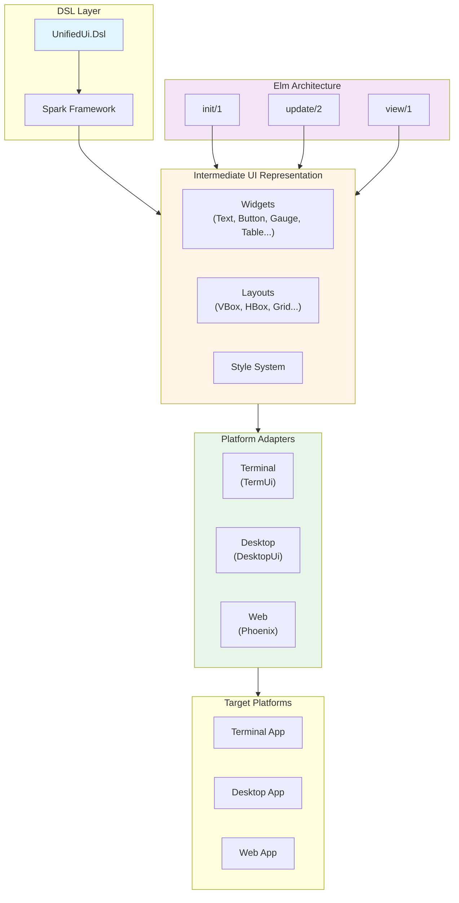

# UnifiedUi

A declarative DSL for building multi-platform user interfaces in Elixir. Define your UI once using a clean, composable syntax and render to terminal, desktop, and web platforms.

## Overview

UnifiedUi enables developers to build user interfaces using a declarative DSL that compiles to platform-specific renderers. Inspired by The Elm Architecture and powered by the Spark framework, UnifiedUi provides:

- **Write Once, Run Anywhere** - Single UI definition targets terminal, desktop, and web
- **Type-Safe DSL** - Compile-time validation with autocomplete and inline documentation
- **Elm Architecture** - Predictable state management with init/update/view pattern
- **Signal-Based Communication** - JidoSignal integration for agent-based component communication
- **Extensible** - Easy to add custom widgets and platforms

## Quick Start

```elixir
defmodule MyApp.LoginScreen do
  @behaviour UnifiedUi.ElmArchitecture
  use UnifiedUi.Dsl

  state username: "", password: "", error: nil

  vbox style: [padding: 2, align_items: :center] do
    text "Login", style: [fg: :cyan, attrs: [:bold]]

    label :username, "Username:"
    text_input :username, placeholder: "Enter your username"

    label :password, "Password:"
    text_input :password, type: :password, placeholder: "Enter your password"

    if state.error do
      text state.error, style: [fg: :red]
    end

    hbox style: [spacing: 2] do
      button "Login", on_click: {:login, %{}}
      button "Cancel", on_click: :cancel
    end
  end

  @impl true
  def init(_opts), do: %{username: "", password: "", error: nil}

  @impl true
  def update(state, %Jido.Signal{type: "unified.button.clicked", data: %{action: :login}}) do
    # Validate and authenticate
    {:ok, %{state | error: nil}}
  end

  def update(state, _signal), do: {:ok, state}
end
```

## Architecture



## Widget Library

### Completed Widgets

| Category | Widgets | Description |
|----------|----------|-------------|
| **Basic** | `text`, `button`, `label`, `text_input` | Core UI primitives |
| **Data Visualization** | `gauge`, `sparkline`, `bar_chart`, `line_chart` | Charts and metrics display |
| **Data Display** | `table` | Tabular data with sorting and selection |
| **Navigation** | `menu`, `context_menu`, `tabs`, `tree_view` | Navigation and content organization |
| **Feedback** | `dialog`, `alert_dialog`, `toast` | Modals and notifications |

### Planned Widgets

| Category | Widgets | Status |
|----------|----------|--------|
| **Input** | `pick_list`, `form_builder`, `command_palette` | Phase 4.5 |
| **Containers** | `viewport`, `split_pane` | Phase 4.6 |
| **Specialized** | `canvas` | Phase 4.7 |
| **Monitoring** | `log_viewer`, `stream_widget`, `process_monitor` | Phase 4.8 |
| **Advanced Layouts** | `grid`, `stack`, `zbox` | Phase 4.9 |

## Layouts

| Layout | Description |
|--------|-------------|
| `vbox` | Vertical box - arranges children top to bottom |
| `hbox` | Horizontal box - arranges children left to right |
| `grid` | Grid layout with flexible rows and columns (planned) |
| `stack` | Stacked layout showing only active child (planned) |
| `zbox` | Absolute positioning layout (planned) |

## Platform Support

| Platform | Status | Renderer | Target |
|----------|--------|----------|--------|
| **Terminal** | ✅ Complete | ASCII-based UI | TermUi |
| **Desktop** | 🚧 In Progress | Native widgets | DesktopUi |
| **Web** | 🚧 In Progress | HTML/CSS | Phoenix LiveView |

## Installation

Add to your `mix.exs`:

```elixir
def deps do
  [
    {:unified_ui, "~> 0.1"},
    {:jido_signal, "~> 0.1"},
    {:spark, "~> 1.0"}
  ]
end
```

## Elm Architecture Integration

UnifiedUi generates standard Elm Architecture callbacks:

```elixir
defmodule MyApp.Counter do
  @behaviour UnifiedUi.ElmArchitecture
  use UnifiedUi.Dsl

  @impl true
  def init(_opts) do
    %{count: 0}  # Initial state
  end

  @impl true
  def update(state, signal) do
    case signal do
      %Jido.Signal{type: "unified.button.clicked", data: %{action: :increment}} ->
        {:ok, %{state | count: state.count + 1}}

      %Jido.Signal{type: "unified.button.clicked", data: %{action: :decrement}} ->
        {:ok, %{state | count: state.count - 1}}

      _ ->
        {:ok, state}
    end
  end

  @impl true
  def view(state) do
    # Returns IUR tree
    vbox do
      text "Count: #{state.count}"
      button "+", on_click: :increment
      button "-", on_click: :decrement
    end
  end
end
```

## Signal Format

Signals follow the pattern `domain.entity.action`:

```elixir
# Simple atom
on_click: :submit

# Tuple with payload
on_click: {:submit, %{form_id: :login}}

# MFA tuple (Module, Function, Args)
on_click: {MyModule, :handle_submit, []}
```

## Styling

### Inline Styles

```elixir
text "Hello", style: [fg: :cyan, attrs: [:bold], padding: 1]
```

### Named Styles

```elixir
defmodule MyApp.Themes do
  use UnifiedUi.Dsl

  style :header, fg: :cyan, attrs: [:bold], padding: 1
  style :primary_button, bg: :blue, fg: :white, padding: [1, 2]
end
```

### Style Attributes

| Attribute | Values | Description |
|-----------|--------|-------------|
| `fg` | Color atom or `{r, g, b}` tuple | Foreground color |
| `bg` | Color atom or `{r, g, b}` tuple | Background color |
| `attrs` | `[:bold, :italic, :underline, :dim, ...]` | Text attributes |
| `padding` | Integer or `[vertical, horizontal]` | Internal spacing |
| `margin` | Integer or `[vertical, horizontal]` | External spacing |
| `width` | Integer, `:auto`, or `:fill` | Width constraint |
| `height` | Integer, `:auto`, or `:fill` | Height constraint |
| `align` | Alignment atom | Content positioning |

## Project Structure

```
unified-ui/
├── unified_ui/           # Main library
│   └── lib/unified_ui/
│       ├── dsl/          # DSL definitions and entities
│       ├── iur/          # Intermediate UI Representation
│       ├── adapters/      # Platform renderers
│       └── elm_architecture.ex  # Behaviour definition
├── unified_iur/         # Standalone IUR package
└── notes/              # Planning and research
```

## Documentation

- **[Spark DSL](https://github.com/ash-project/spark)** - Framework for building DSLs
- **[JidoSignal](https://github.com/agentjido/jido_signal)** - Signal-based communication
- **[TermUi](https://github.com/pcharbon70/term_ui)** - Terminal UI framework

## Development

```bash
# Run tests
mix test

# Format code
mix format

# Check documentation coverage
mix docs
```

## License

MIT

## Related Projects

- [jido_signal](https://github.com/agentjido/jido_signal) - Agent communication envelopes
- [term_ui](https://github.com/pcharbon70/term_ui) - Terminal UI framework
- [desktop_ui](https://github.com/pcharbon70/desktop_ui) - Desktop UI framework
- [web_ui](https://github.com/pcharbon70/web_ui) - Web UI framework
- [unified_iur](https://github.com/pcharbon70/unified_iur) - Intermediate UI Representation
