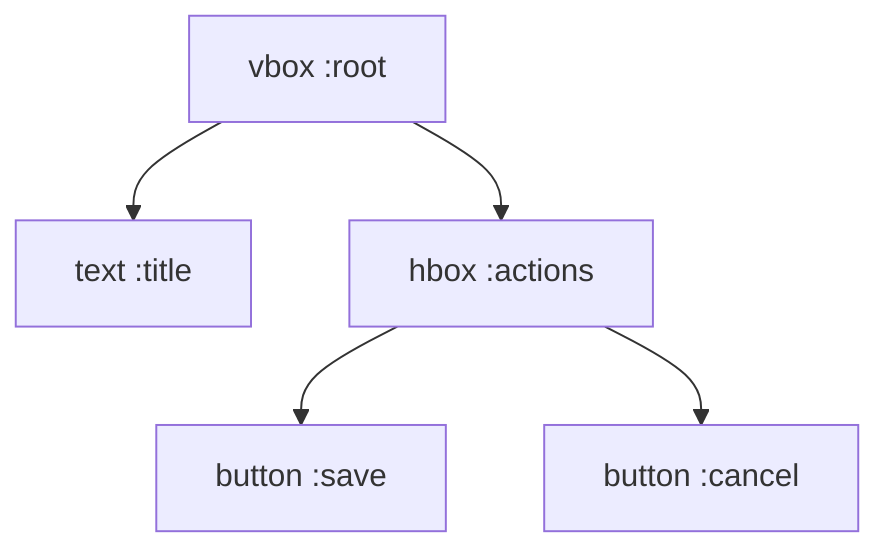

# Layout System

UnifiedUi currently provides `vbox` and `hbox` as core layout containers.

## Mental Model

- Layouts are trees.
- Parent containers control stacking direction and spacing.
- Child elements inherit visibility/structure from the tree.



## `vbox`

Stacks children top-to-bottom.

```elixir
vbox do
  id :root
  spacing 1
  padding 1
  text "Settings"
  text_input :username, placeholder: "Username"
end
```

## `hbox`

Stacks children left-to-right.

```elixir
hbox do
  id :row
  spacing 2
  align_items :center
  label :search, "Search"
  text_input :search, placeholder: "Type query"
end
```

## Shared Options

Both layouts support:

- `id`
- `spacing`
- `padding`
- `align_items`
- `justify_content`
- `style`
- `visible`

## Nesting Patterns

- Use `vbox` for page-level composition.
- Use nested `hbox` rows for compact controls.
- Keep IDs stable for event routing and test assertions.

## Current Limits

Planned advanced layouts (`grid`, `stack`, `zbox`) are not implemented yet. Model advanced compositions with nested `vbox`/`hbox` in the meantime.
